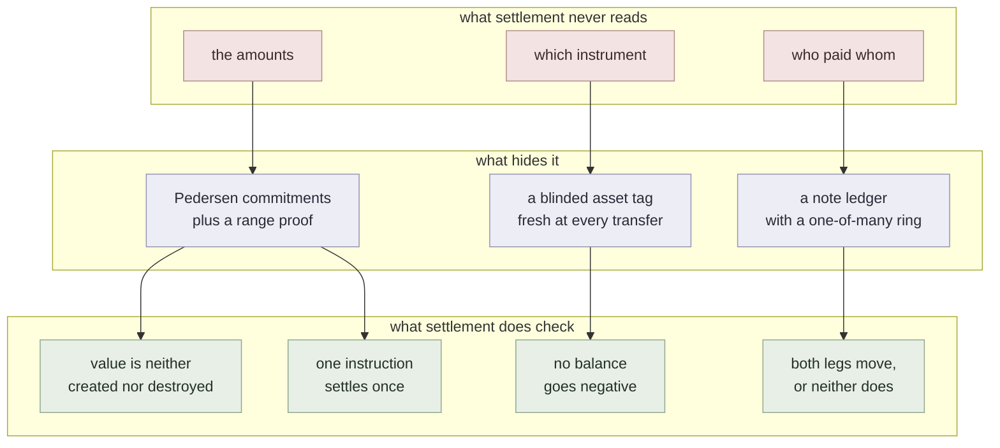
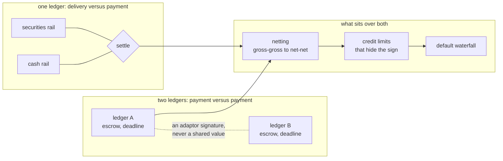

# defmi

Delivery versus payment for committed holdings: two legs that move together or not at all.

## What it does



## What it is made of



Exported from a single research tree by `scripts/export_repos.py`, which is why
the layout is regular across the three repositories and why nothing here is
hand-maintained. Corrections are welcome; they belong upstream, and the export
is re-run.

## What is here

Rust:

- `rust/qomm-defmi`

Python:

- `defmi/`

`artifacts/` holds the measurements the numbers in the paper are taken from, as
the runners wrote them. Each carries the host it ran on as a label (`host-a`,
`host-b`, `host-c`); `scripts/hosts.py` is the mapping.

## Depends on

- [zkpi](https://github.com/shukob/zkpi)

Cargo picks these up as git dependencies and needs nothing from you. Python does not, so install them first:

```
pip install "zkpi @ git+https://github.com/shukob/zkpi"
```

## Running it

```
cargo test --release          # in rust/
pip install "zkpi @ git+https://github.com/shukob/zkpi"
python3 -m pytest tests/      # from the repository root
```

## Measurements

Every reported number has an artifact and a command that produces it. Where a
measurement needs something not shipped here --- MP-SPDZ, a second host, a market
data feed --- the command says so and fails rather than substituting a default.

## License

MIT. See `LICENSE`.
